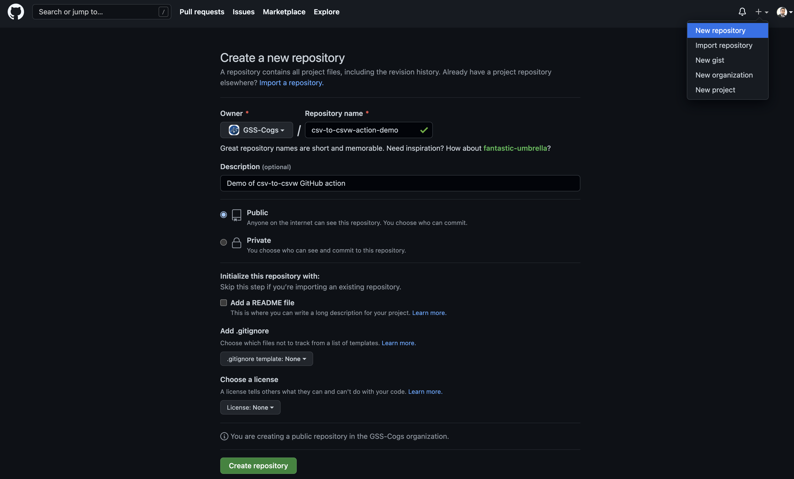
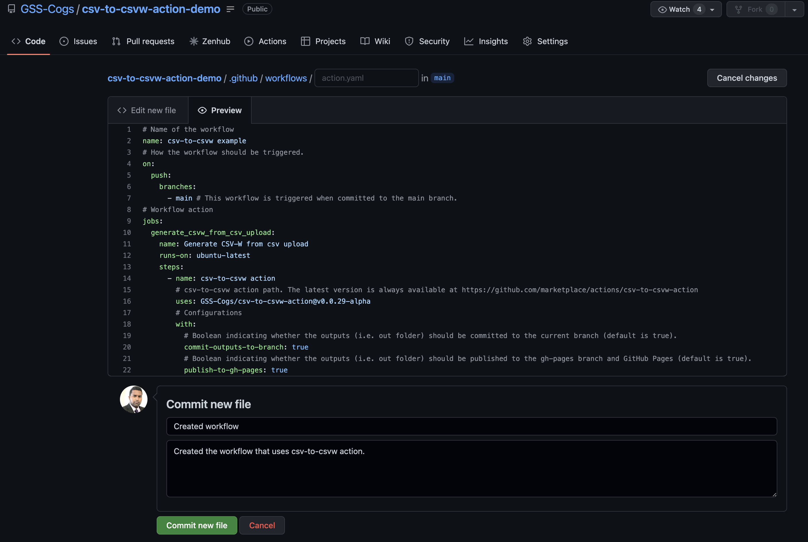
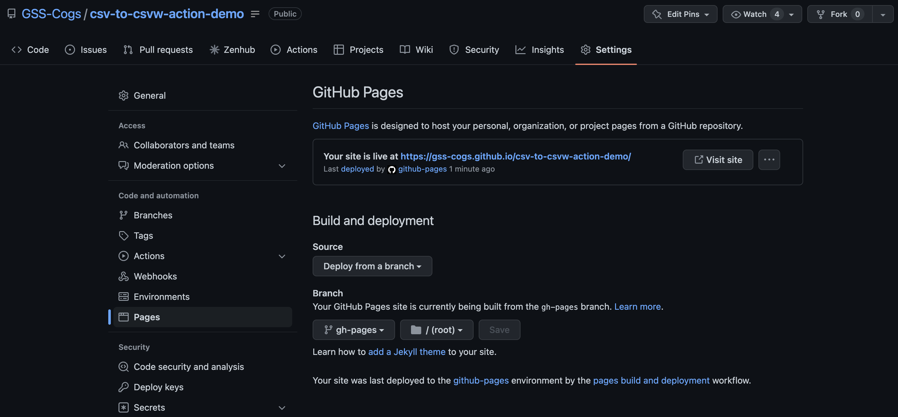
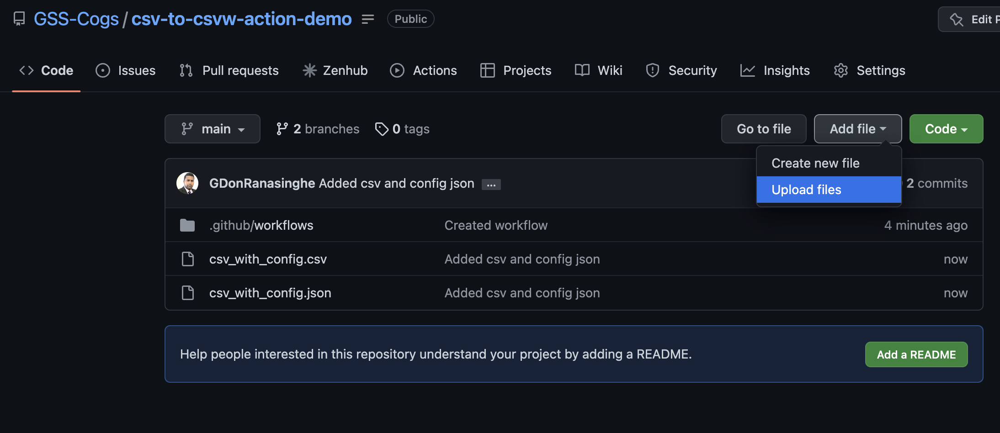
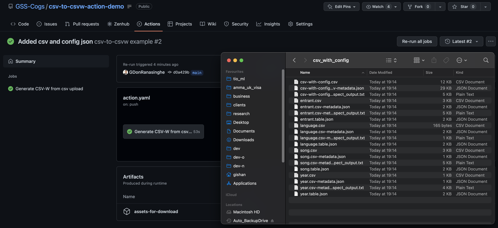
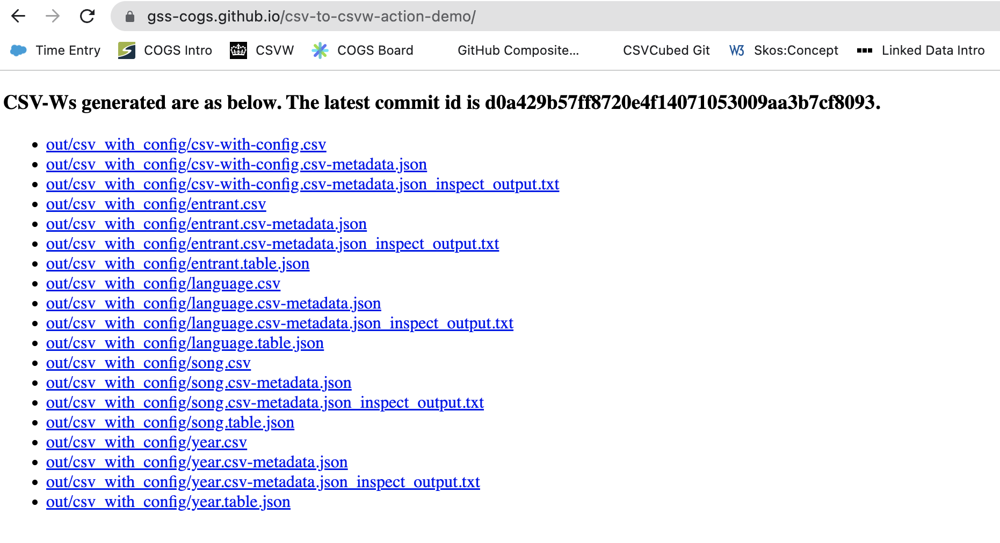

# Build with csv-to-csv-w GitHub action

The [csv-to-csvw GitHub action](https://github.com/marketplace/actions/csv-to-csvw-action) enables you to build CSV-Ws by pushing CSV and [qube-config.json](https://gss-cogs.github.io/csvcubed-docs/external/guides/configuration/qube-config/) files to a Git repository configured with [Github Actions](https://docs.github.com/en/actions). It is designed to bring csvcubed to users who have difficulty installing software in corporate environments, or for those who want to keep a versioned history of their publications.

For information on how to install csvcubed locally, take a look at the [installation quick start](https://gss-cogs.github.io/csvcubed-docs/external/quick-start/installation/).

The remainder of this guide walks you through how the csv-to-csvw GitHub action works, and then guides you through the process of [setting up](#setup) your own GitHub repository which converts CSV inputs into CSV-Ws.

## Inputs 

The action expects the user to organise the inputs as follows:

* The CSV files and their configuration JSONs can be at any location inside the repository.
* If a CSV file has a configuration JSON, the filename of the configuration JSON needs to match the filename of the CSV file. And both files need to be stored at the same location. For example, `csv/my_data.csv` and `csv/my_data.json`.

## Build process

In this section, an introduction to the key steps performed by the action is provided.

The action script can be observed in the [csv-to-csvw-action repository](https://github.com/GSS-Cogs/csv-to-csvw-action). An example respository a user would create to use the action can be observed in the [csv-to-csvw-example repository](https://github.com/GSS-Cogs/csv-to-csvw-action-example).

### 1. Triggering the job

The action is triggered when the user adds, edits or deletes a CSV and optionally a configuration file, to the repository created by the user. The user can commit these files in any preferred folder structure, including committing to the root of the respository. An example set of files committed to the repository with various folder structures is available [here](https://github.com/GSS-Cogs/csv-to-csvw-action-example).

>NOTE: committing files to the `out` folder at the root of the repository will not trigger the action. This folder is reserved for storing the outputs produced by the action.

### 2. Building and inspecting CSV-Ws

On a new commit, the action runs the [`csvcubed build`](https://gss-cogs.github.io/csvcubed-docs/external/guides/command-line/build-command/) on any CSV or JSON files which have been changed. The outputs produced by the build command are saved using the same folder structure used to store the CSV or JSON files. For example, given a CSV file located at `my_folder/my_data.csv`, the outputs will be written to the `out/my_folder/my_data/` folder.

The [`csvcubed inspect`](https://gss-cogs.github.io/csvcubed-docs/external/guides/command-line/inspect-command/) command is then run on all new or updated CSV-Ws; the output is then saved in an `inspect_output.txt` file next to each CSV-W output. For example, for the metadata JSON file at `out/my_folder/my_data/my_data.csv-metadata.json` a file, containing the [`csvcubed inspect`](https://gss-cogs.github.io/csvcubed-docs/external/guides/command-line/inspect-command/) command output, named `out/my_folder/my_data/my_data.csv-metadata.json_inspect_output.txt` is created.

### 3. Producing outputs

#### GitHub artifacts

The action publishes CSV-Ws and inspect command outputs to GitHub artifacts. The user can download a zip file consisting of the CSV-Ws and inspect command output from the artifacts section within the GitHub action run. More information on how to download the artifacts is available in the GitHub guide on [How to Download GitHub Action Artifacts](https://docs.github.com/en/actions/managing-workflow-runs/downloading-workflow-artifacts).

#### Committing outputs to `out` folder

If the `commit-outputs-to-branch` configuration is set to `true`, the action commits the outputs to a folder called `out` in the root of the repository upon completion. This helps to maintains a history of the outputs produced.

#### GitHub Pages

If the `publish-to-gh-pages` configuration is set to `true`, the action publishes the CSV-Ws and inspect command outputs to [GitHub Pages](https://pages.github.com/)' static file hosting. The action generates an `index.html` page listing the CSV-W outputs. The URL to access the GitHub page is provided in GitHub pages setting of the repository which is discussed in the [Setup](#setup) section below.

## Setup

To use the csv-to-csvw GitHub action,

1. Ensure that you [created](https://github.com/signup) and/or [logged into](https://github.com/login) your GitHub user account.

2. Create a new repository and give it a name.


3. Create a new file with extention `.yaml` (i.e. an YAML file) under the `.github/workflows` folder and give it a name (e.g. action.yaml). Then add the below content into it and commit the file.

> NOTE: Read the comments in below content to get familiarised with the supported configurations.

```YAML
# Name of the workflow
name: csv-to-csvw example
# How the workflow should be triggered.
on:
  push:
    branches:
      - main # This workflow is triggered when committed to the main branch.
# Workflow action
jobs:
  generate_csvw_from_csv_upload:
    name: Generate CSV-W from csv upload
    runs-on: ubuntu-latest
    steps:
      - name: csv-to-csvw action
        # csv-to-csvw action path. The latest version is always available at https://github.com/marketplace/actions/csv-to-csvw-action
        uses: GSS-Cogs/csv-to-csvw-action@v0.0.29-alpha
        # Configurations
        with:
          # Boolean indicating whether the outputs (i.e. out folder) should be committed to the current branch (default is true).
          commit-outputs-to-branch: true
          # Boolean indicating whether the outputs (i.e. out folder) should be published to the gh-pages branch and GitHub Pages (default is true).
          publish-to-gh-pages: true
```


4. Create a new branch called `gh-pages`. This branch will be used to publish the outputs to GitHub Pages. Then go to the repository's settings and set the branch for GitHub pages - under the `Source` section, set the `Branch` to `gh-pages` and set the folder location to `/(root)`. Also, keep a note of the URL at which your GitHub Pages site is published at.


5. Now that the repository is created and the GitHub Pages setting is configured, you can commit and push your inputs using the GitHub web console.


6. Once the inputs have been committed, the action will automatically [run](#key-steps-performed-by-the-action). To see the progress of the action, go to the `Actions` section in the GitHub web console.

A more detailed view of the progress of the action can be seen by clicking on the action.


7. Once the csv-to-csvw action has finished, another action called `pages build and deployment` will run. This action is responsible for deploying the outputs to GitHub pages.


8. Now we are ready to explore the outputs produced by the action. First look at the `out` folder within the repository. If you are using the GitHub Desktop Client or the Github Command Line Interface, make sure to run `git pull` beforehand. The `out` folder now consists of the CSV-Ws and inspect command logs generated for inputs committed to the repository.

Then download the artifacts produced by the GitHub action. The downloaded folder consists of the CSV-Ws and inspect command logs.

Finally, open the GitHub pages URL noted in Step 2 in the preferred web browser. A web page with all the outputs listed with downloadable links will appear in the browser.

